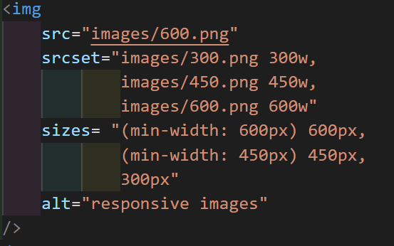

# [210903 임베디드요소]

</br>

## 1. img - src

- `````` 요소는 문서에 이미지를 넣는다.
- src 특성은 필수이며, 포함하려는 이미지의 주소를 지정한다.
- 이미지의 경로를 지정하는 방법은 상대경로, 절대경로 두가지가 있다.
</br></br>

- 절대경로
  - ``````
  - 코드 작성 시
    - ``````
  - 코드 실행 시
    - 
    - 
</br>

- 상대경로
  - 이미지를 삽입할 HTML 문서의 위치를 기준으로 경로를 지정하는 방식이다.
  - 이미지 파일이 HTML 문서와 같은 폴더에 있다면 이미지 파일명만 적어주면 된다.
  - 이미지 파일이 상위 폴더에 있다면 ```<../>```으로 표현해서 이동해야한다.
  - 이미지 파일이 하위 폴더에 있다면 ```</>```를 사용하여 이동해야한다.</br>
  - 코드 작성 시
    - ``````
  - 코드 실행 시
    - 
</br></br>

## 2. img - alt, width, height

- ```<alt>```
  - 이미지의 텍스트 설명을 추가하는 요소이다.
  - 필수 요소는 아니지만 웹 접근성에 매우 유용하다.
  - 그뿐 아니라 오류로 이미지를 표시할 수 없을 때 이 속성의 값이 대신 보여진다.

- ```<width>```
  - 이미지의 픽셀 기준 고유 너비를 의미한다.
  - 단위가 없는 정수로 지정해야한다.

- ```<height>```
  - 이미지의 픽셀 기준 높이를 의미한다.
  - width와 같이 단위가 없는 정수로 지정해야한다.

- 코드 작성 시
  - ``````

- 코드 실행 시
  - 

- 코드 작성 시
  - ``````

- 코드 실행 시
  - 
  
</br></br>

## 3. 반응형 이미지

- ```<srcset>```
  
  - ```<srcset>``` 요소는 사용자의 화면 크기에 따라서 이미지의 크기를 조절할 수 있는 요소이다.
  - placeholder홈페이지에서 이미지의 크기를 미리 저장하여 사용하면 된다. <https://via.placeholder.com/***>  ***위치에 원하는 이미지의 사이즈를 단위없이 정수로 작성하여 저장한다.
  - 코드 작성 시
    - ``````

  - 코드 실행 시
    - 

- ```<sizes>```
  - 특정 조건에 따라서 사이즈를 지정하는 요소이다.
  - 코드 작성 시
    - 

## 4. video, audio

- ```<video>```요소는 비디오를 문서에 삽입하는 요소이다.
  - ```<video>```특성
    - ```<autoplay>```:비디오를 자동 재생하는 요소이다.
    - ```<controls>```:소리 조절, 동영상 탐색, 일시정지, 시작 등 사용자가 조작할 수 있도록 컨트롤러를 제공한다.
    - ```<muted>```: 비디오를 재생하기 전까지 소리가 나오지 않도록 하는 요소이다.
    - ```<poster>```: 사용자가 재생하기 전까지 출력되는 프레임을 설정하는 요소이다.
- ```<audio>```요소는 오디오를 문서에 삽입하는 요소이다.
  - 위 video 특성과 거의 유사하다.